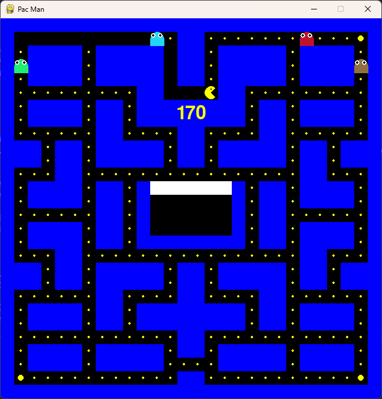
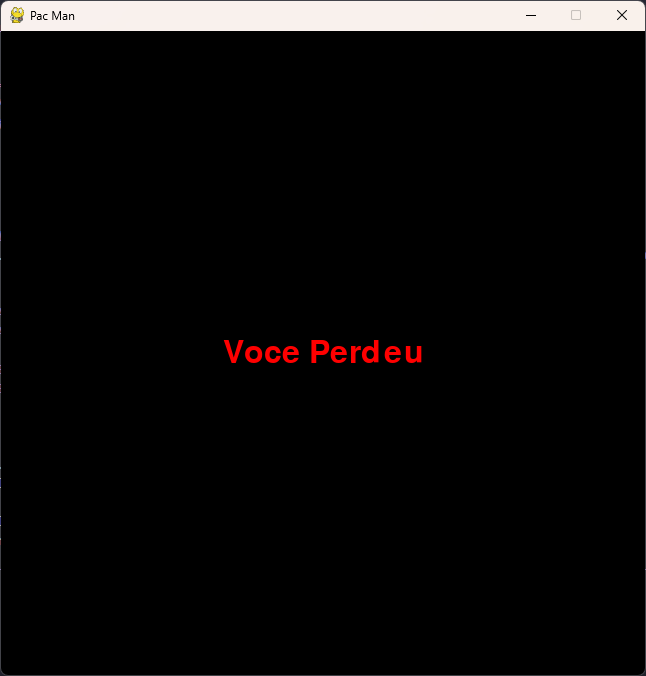

# Pacman Game

Este projeto é uma implementação do clássico jogo Pacman, desenvolvido utilizando a biblioteca [Pygame](https://www.pygame.org/).

## 🕹️ Sobre o Jogo

No jogo, você controla o **Pacman** por um labirinto enquanto tenta coletar todos os pontos e evitar os temidos **fantasminhas**. O objetivo é simples: obter a maior pontuação possível sem ser capturado.

### Características
- **Pacman**: O personagem principal que o jogador controla.
- **Fantasminhas**: Inimigos que perseguem o Pacman dentro do labirinto.
- **Labirinto**: O cenário onde o Pacman e os fantasminhas se movimentam.
- **Pontos**: Itens que o Pacman coleta para aumentar sua pontuação.
- **Contagem de Pontos**: Pontuação visível para o jogador com base nos pontos coletados.

## 📷 Imagens do Jogo

### Jogo em Ação


### Game Over


## 🛠️ Como Executar o Jogo

1. Certifique-se de ter o [Python](https://www.python.org/downloads/) e o [Pygame](https://www.pygame.org/wiki/GettingStarted) instalados.
2. Clone este repositório:

   ```bash
   git clone https://github.com/gustakakkoii/pacman.git
   ```

3. Acesse o diretório do projeto:

   ```bash
   cd pacman-game
   ```

4. Execute o jogo:

   ```bash
   python main.py
   ```

## 📚 Requisitos

- **Python 3.6+**
- **Pygame 2.0+**

Instale as dependências com:

```bash
pip install pygame
```

## 💡 Como Jogar

- Use as **setas do teclado** para mover o Pacman pelo labirinto.
- Colete todos os pontos enquanto desvia dos fantasmas para ganhar.
- Acompanhe a **contagem de pontos** no topo da tela.

## 🏆 Pontuação

- Cada ponto coletado aumenta sua pontuação.
- O jogo termina quando o Pacman é capturado por um fantasma.

## Contribuições

Sinta-se à vontade para abrir **issues** ou enviar **pull requests** para melhorar o jogo!

---

Desenvolvido por [Gustavo Almeida](https://github.com/gustakakkoii)
